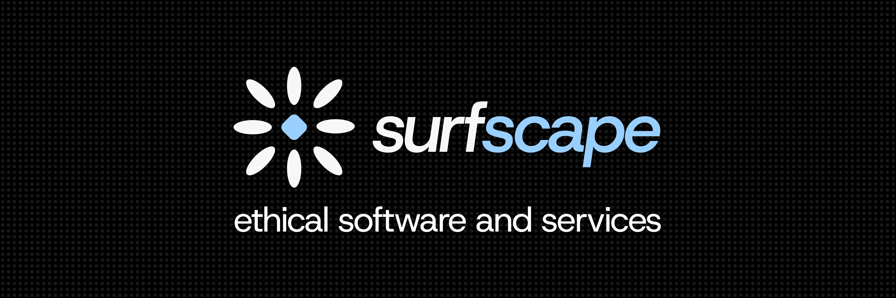

# SurfScape

<b><a href="https://surfscape.neocites.org/">Website</a></b> ~ <b><a href="https://codeberg.org/SurfScape">Codeberg</a></b> ~ <b><a href="https://fosstodon.org/@surfscape">Fosstodon (@surfscape)</a></b> ~ <b><a href="https://neocities.org/site/surfscape">Neocities</a></b>

> Developing ethical solutions with a focus on user control and privacy

Welcome to the offical GitHub organization for the SurfScape project!

## About us

SurfScape is an umbrella that develops ethical software and services that have heavy focus on user choice, privacy, and minimalism.

## Active Projects

- **[Website](https://github.com/surfscape/web-portal)** - Our official website, currently hosted on SurfScape
- **[Blueprint*](https://github.com/surfscape/blueprint)** - The official wiki for SurfScape. Included detailed information on what SurfScape is, how to contribute, as well as being the home to our developer documentation for all of our products.
- [Steel*](https://github.com/surfscape/steel) - Our official design language/system used troghout our products, with a focus on utilitarism, minimalism and customization
- [Gaming*](https://github.com/surfscape/gaming) - Gaming web portal (alternative to GameVortex)
- [Collectio*](https://github.com/surfscape/collectio) - Offline web app for saving & organizing links by tags and collections. Works in-browser with no backend.

> [!NOTE]
> Projects with an asterisk '*' are currently in development and are most likely private.

> [!NOTE]
> Links marked in bold are our go-to recommendations for beginners.

## Archived

Most of the projects below either have a better version available or have no use.

- [GameVortex](https://github.com/surfscape/gamevortex) Our web gaming portal currently offering flash and HTML5 (in alpha) games for everyone
- [SurfKit](https://github.com/surfscape/surfkit) - Our UI design system and CSS library
- [Labs](https://github.com/surfscape/labs) - Experiments portal

