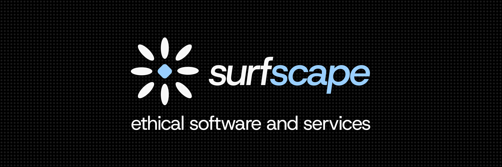

# SurfScape

<b><a href="https://surfscape.eu/">Website</a></b> ~ <b><a href="https://fosstodon.org/@surfscape">Fediverse</a></b> ~ <b><a href="https://bsky.app/profile/surfscape.eu">Bluesky</a></b> ~ <b><a href="https://www.instagram.com/surfscape.eu/">Instagram</a></b>

SurfScape is a collective that develops ethical software and services with focus on user choice, privacy, and minimalism.

## Projects

- [Celer](https://github.com/surfscape/celer) - The toolbox for Windows 10/11
- [Nuage](https://github.com/surfscape/Nuage) - The minimalist weather app
- [customWin](https://github.com/customWin) - Patching tools for Windows
