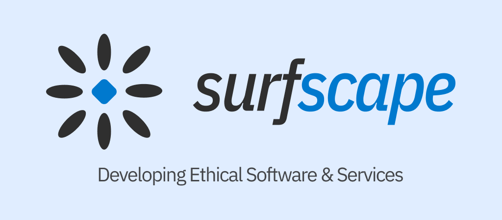

# SurfScape

<b><a href="https://surfscape.eu/">Website</a></b> ~ <b><a href="https://codeberg.org/SurfScape">Codeberg</a></b> ~ <b><a href="https://fosstodon.org/@surfscape">Fediverse (@surfscape)</a></b> ~ <b><a href="https://neocities.org/site/surfscape">Neocities</a></b>

SurfScape is an umbrella that develops ethical software and services that have heavy focus on user choice, privacy, and minimalism.

## Projects

- [Celer](https://github.com/surfscape/celer) - The toolbox for Windows 10/11
- [Nuage](https://github.com/surfscape/Nuage) - The minimalist weather app
- [customWin](https://github.com/customWin) - Home of the customIcons, driveIconPatcher, and more Windows patching tools!
